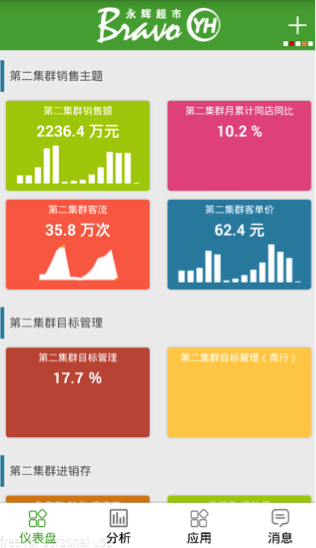
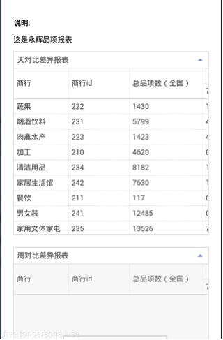
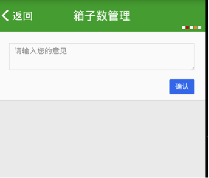
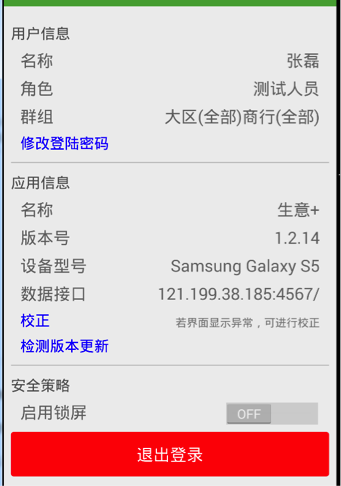
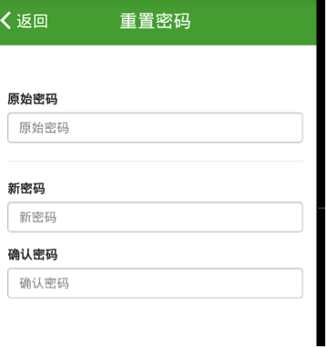
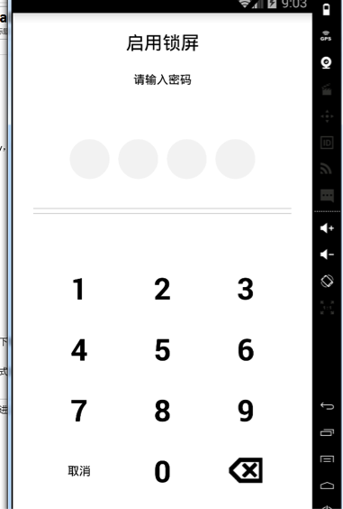

## 登录

### 登陆界面

1. 读取本地asset中的loading
2. 显示loading/login.html页面
3. 资源路径

	```
	/data/data/com.intfocus.yh_android/files/Shared/loading/
	```

### 用户验证


1. 调用方法
	
	```
	ApiHelper.authentication(mContext, username, URLs.MD5(password));
	```

2. 响应过程
	
	```
	post /api/v1/android/username/password/authentication
	
	params: 
	{
		"device"：{
		    "os": "Samsung Galaxy S5 - 4.4.4 - API 19 - 1080x1920",
		    "platform": "android",
		    "uuid": "772f48dd8599a5b0",
		    "os_version": "4.4.4",
		   "name": "Samsung Galaxy S5 - 4.4.4 - API 19 - 1080x1920"
		}
	}
	
	response:
	{
	    "group_name": "XXXX",
	    "role_id": 1,
	    "group_id": 165,
	    "code": 200,
	    "app_ids": [],
	    "analyse_ids": [],
	    "device_state": true,
	    "kpi_ids": [],
	    "user_name": "XXX",
	    "user_device_id": ,
	    "user_num": "",
	    "device_uuid": "",
	    "user_id": 3020,
	    "role_name": "XXXX",
	    "loading_md5": "c10780bc76c8971d78ab5244b65b4b77",
	    "assets_md5": "7e58d787137b055d5ec877134396c7ab"
	    "assets": {
	        "stylesheets_md5": "1d10ad9a61e9cd0662a298610680bd26",
	        "javascripts_md5": "9287afcbd064e2ac30378d0847cf3fad",
	        "fonts_md5": "5901960c857600316c3d141401c3af08",
	        "images_md5": "1afa5893736851156a3612b34c1d88a6"
	    },
	}
	```
	
	
### 登录界面图示


## 主界面
加载mainActivity的界面，分别为仪表盘、分析、应用、消息、设置

### 校正

1. 校正的逻辑

	```
	调用checkAssetsUpdated方法，若资源库不存在将isShouldUpdateAssets改为true，读取/data/data/com.intfocus.yh_android/files/user.plist，将其转为JSON格式，若MD5值不同，运行DownloadAssetsTask线程，从服务器端下载更新资源库
	```

2. 下载资源的链接

	```
	/api/v1/download/assetName.zip
	```

### 子界面服务器链接

1. 仪表盘

	```
	/mobile/role/1/group/165/kpi
	```

2. 分析

	```
	/mobile/role/1/analyse
	```

3. 应用

	```
	/mobile/role/1/app
	```

4. 消息

	```
	/mobile/role/1/group/165/user/3020/message
	```

### 本地资源库


如仪表盘界面：

	/data/data/com.intfocus.yh_android/files/User-3020/	HTML/_mobile_role_1_group_165_kpi.html

### 读取PDF文件


1. PDF文件路径

	```
	/data/data/com.intfocus.yh_android/files/Cached/	f3cd3e034effc757cf85c9164735d314.pdf
	```

2. 调用方法

	```
	mPDFView.fromFile(pdfFile)
                      .showMinimap(true)
                      .enableSwipe(true)
                      .swipeVertical(true)
                      .load();
	```


### 图示

#### 主界面



#### 报表/PDF界面



## 评论

### 上传评论

1. 服务器链接

	```
	/api/v1/user/userID/id/objectID/type/objectType
	```

2. 上传参数

	```
	params：{
 	   “content”: ”test”,
 	   ”user_name”: ”XXXX”,
 	   ”object_title”: ”测试报表模版2”
	}
	```

3. 服务器响应

	```
	responseBody:{
		"info":"评论(21) 创建成功.",
		"code":201
	}
	```
	
### 图示



## 设置

### 修改密码

1. 界面路径

	```
	/data/data/com.intfocus.yh_android/files/User-3020/	HTML/_mobile_update_user_password.html
	```
	
2. 服务器链接

	```
	/api/v1/update/3020/password
	```
3. 上传参数

	```
	params：{
	    “password”: ”96e79218965eb72c92a549dd5a330112”
	}
	```
4. 服务器响应

	```
	密码重置成功：
	
	{
 	   "info": "密码更新成功",
 	   "code": 201
	}
	
	密码重置失败：
	
	显示Toast：原始密码输入有误
	```
	
### 校正

	和主界面中的校正一样
	
### 锁屏

1. 有锁屏时的逻辑

	```
	锁屏开关设置监听器mSwitchLockListener，勾选至on	，isChecked为true，跳转至InitPassCodeActivity，设置锁屏密码，同时将/data/data/com.intfocus.yh_android/files/user.plist中的use_gesture_password改为true	
	```

2. 无锁屏时的逻辑

	```
	锁屏开关设置监听器mSwitchLockListener，不勾选，isChecked，读取/data/data/com.intfocus.yh_android/files/user.plist，将其中的use_gesture_password改为false
	```
3. 锁屏，输入正确密码后的后续操作

	```
	在LoginActivity中的onCreate方法中，获取intent的信息。如果是从触屏界面过来，即intent有from_activity的信息并且from_activity中包含ConfirmPassCodeActivity则直接进入主界面。
    不是的话，相当于直接启动应用，则调用FileUtil的checkIsLocked方法读取/data/data/com.intfocus.yh_android/files/user.plist，判断use_gesture_password是否为true，则进入ConfirmPassCodeActivity，若为false，则直接进入mainActivity界面

	```
	
### 图示

#### 设置界面



#### 重置密码界面



#### 锁屏界面



## 上传用户行为
1. 上传的用户行为

	```
	登录、解屏
	```
2. 服务器链接

	```
	/api/v1/android/logger
	```

3. 上传参数

	```
	{
    	"action_log": {
   	    	"action": "解屏",
   	    	"app_version": "a1.2.14",
        	"user_name": "XXX",
        	"user_id": 3020,
        	"user_device_id": 734
    	},
    	"user": {
        	"user_pass":"d27004b28a82aa04a7d6ef3026a4eaf4",
        	"user_name": "XXX"
    	}
	}
	```
4. 服务器响应

	```
	{
    	"info": "创建成功",
    	"code": 201
	}
	```
	
## 界面缓存机制

1. 如何达到缓存效果

	```
	第一次请求之后，客户端中已经存在缓存，客户端再次发送请求，有以下几种情况：
	
	缓存没过期，则直接从缓存中读取数据。
	
	缓存过期：
	
		若向服务器的请求头中有ETag和Last-Modified，则添加User-Agent，IF-None-Match，If-Modified-Since到请求头
		
		若向服务器的请求头中只有ETag，则添加User-Agent，IF-None-Match到请求头
		
		若向服务器的请求头中只有Last-Modified，则添加User-Agent，If-Modified-Since到请求头
		
		若向服务器的请求头中没有ETag和Last-Modified，则添加User-Agent到请求头
		
		前三种情况若返回304，则从缓存中读取数据
		
		前三种情况若返回200，则和第四种情况一样，请求响应，缓存协商
		
	```

2. 缓存的意义

	```
	暂时保存用户以前访问过的信息，无需重新从服务器下载新的数据，直接从本地得到未更新的数据。
	```