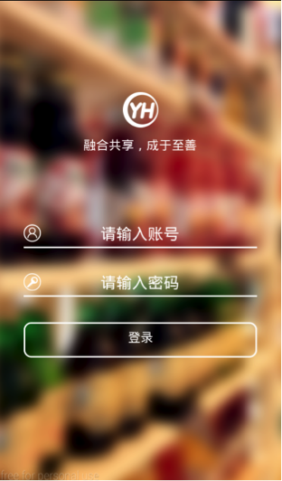

## 登录

### 登陆界面

1. 读取本地asset中的loading
2. 显示loading/login.html页面

### 用户验证


1. 调用方法
	
	```
	ApiHelper.authentication(mContext, username, URLs.MD5(password));
	```

1. 响应过程
	
	```
	post /api/v1/android/username/password/authentication
	
	params: 
	{
		"device"：{
		    "os": "Samsung Galaxy S5 - 4.4.4 - API 19 - 1080x1920",
		    "platform": "android",
		    "uuid": "772f48dd8599a5b0",
		    "os_version": "4.4.4",
		   "name": "Samsung Galaxy S5 - 4.4.4 - API 19 - 1080x1920"
		}
	}
	
	response:
	{
	    "group_name": "大区(全部)商行(全部)",
	    "role_id": 1,
	    "group_id": 165,
	    "code": 200,
	    "app_ids": [],
	    "analyse_ids": [],
	    "device_state": true,
	    "kpi_ids": [],
	    "user_name": "张",
	    "user_device_id": ,
	    "user_num": "",
	    "device_uuid": "",
	    "user_id": 3020,
	    "role_name": "测试人员",
	    "loading_md5": "c10780bc76c8971d78ab5244b65b4b77",
	    "assets_md5": "7e58d787137b055d5ec877134396c7ab"
	    "assets": {
	        "stylesheets_md5": "1d10ad9a61e9cd0662a298610680bd26",
	        "javascripts_md5": "9287afcbd064e2ac30378d0847cf3fad",
	        "fonts_md5": "5901960c857600316c3d141401c3af08",
	        "images_md5": "1afa5893736851156a3612b34c1d88a6"
	    },
	}
	```
	
	
### 显示图片示例




## 主界面
1. 检测服务器静态资源是否更新，用本地资源MD5与服务器资源MD5值匹配，下载MD5值不同的资源
2. 加载mainActivity的界面，分为仪表盘、分析、应用、消息、设置

### 界面内容

1. 仪表盘
```
mobile/role/1/group/165/kpi
```
2. 分析
```
mobile/role/1/analyse
```
3. 应用
```
mobile/role/1/app
```
4. 消息
```
mobile/role/1/group/165/user/3020/message
```

### 显示图片示例


## 报表主题